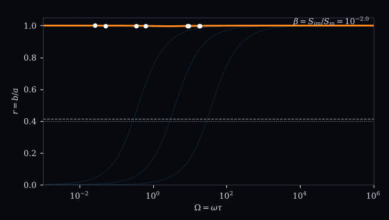
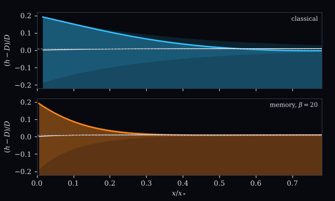

# Supplementary Materials "An Idealized Model of Matrix Storage and the Tidal Response of Coastal Aquifers"

[](https://doi.org/10.5281/zenodo.23165286)
[](https://www.python.org)
[](https://numpy.org)
[](https://scipy.org)
[](https://peps.python.org/pep-0008/)
[](LICENSE)

Supplementary code for an idealized, data-free model of how water exchange
between conduits and matrix blocks changes the attenuation and phase lag
of tides propagating into a coastal aquifer, and of when that exchange makes
the aquifer behave as a time-fractional medium.

**Authors:** Sandy H. S. Herho, Dasapta E. Irawan, Iwan P. Anwar, Rusmawan Suwarman, and Deny J. Puradimaja

## Animations

<p align="center">
  
</p>
<p align="center"><em>
One M2 cycle in the reference aquifer. Top: conduit head (amber) and the
classical aquifer with the same total storage (cyan). Bottom: head inside
the matrix blocks.
</em></p>

<p align="center">
  
</p>
<p align="center"><em>
Ratio of phase lag to attenuation, r = b/a, against frequency as the
matrix storage ratio β sweeps from 0.01 to 10 000. Dots: the eight
reference constituents. Faint curves: leakage.
</em></p>

<p align="center">
  
</p>
<p align="center"><em>
Unconfined aquifer over one tidal period, ε = 0.2: classical (top) and
with matrix memory, β = 20 (bottom). White: period mean. Dashed: exact
far-field mean.
</em></p>

## Key results

Each tidal constituent decays inland as exp[−(a + ib)x], with
κ² = iΩ c(Ω), complex capacity c = 1 + βG, and β = S<sub>im</sub>/S<sub>m</sub>.
The measured pair (a, b) is exactly the complex storage capacity at that
frequency:

```math
a^2 - b^2 = -\Omega\,\mathrm{Im}\,c, \qquad 2ab = \Omega\,\mathrm{Re}\,c .
```

Leakage makes a² − b² the same at every frequency, whereas storage memory
makes it a relaxation peak. One constituent alone cannot tell them apart.

For any passive storage exchange or leakage, r = b/a ≤ 1. For diffusive
exchange with matrix blocks of any sizes,

```math
r \ge \tan\left(\frac{\pi}{8} + \frac{\delta_s}{2}\right) = 0.39798,
\qquad
\delta_s = \min_u \arctan\frac{\sin 2u}{\sinh 2u} = -0.027868,
```

and r > tan(π/8) = 0.41421 for cylindrical or spherical blocks.

A power-law distribution of block sizes, with density q s<sup>q−1</sup>, gives,
up to exponentially small terms,

```math
G = q\,I_q\,(i\Omega)^{-q/2} - \frac{q}{1-q}\,(i\Omega)^{-1/2},
```

a time-fractional plateau of order γ = 1 − q/2 between one half and one,
with r = tan(γπ/4). Matrix diffusion cannot produce an order below one
half.

In the nonlinear unconfined aquifer, the period mean of H² equals
1 + ε²/2 everywhere, and the mean water-table rise (ε²/4)(1 − e<sup>−2ax</sup>)
depends on attenuation alone.

| Reference aquifer (β = 20, τ = 1.50 d) | Value |
| --- | --- |
| r at M2, K1 | 0.493, 0.459 |
| r at MSf, Sa | 0.820, 0.992 |
| Noncentrality against leakage, M2 S2 K1 O1, 30 d | 5.5 × 10³ |
| Weak memory, β = 0.2 (r ≈ 0.97), same record | 34.5, power 0.998 |
| Switch-on transient of a Caputo medium, γ = 0.75 | decays as t<sup>−1.375</sup> |

## Verification

| Check | Result |
| --- | --- |
| Dual porosity against exact solution, spatial orders | 1.96, 1.98, 2.00, 2.00 |
| BDF2, temporal orders | 1.98 to 2.00 |
| L1 scheme, orders for γ = 0.25, 0.5, 0.75 (theory 2 − γ) | 1.72, 1.49, 1.25 |
| Kramers-Kronig, slab, cylinder, sphere (max abs error) | 9.2e-12, 9.2e-12, 9.7e-12 |
| Power-law quadrature against closed form | 7e-16 to 6e-15 |
| Exact Caputo solution at t = 0 | −2.8e-17 |
| Nonlinear correction to the fundamental, slope (theory 2) | 2.000 |
| Invariant of H², classical and memory | 5.7e-13, 6.4e-8 |

Full residuals are in `outputs/reports/verification.txt`.

## Figures

All figures are in `outputs/figures` as vector PDF and 600 dpi PNG, and the
data behind every panel are in `outputs/data` as CSV.

| File | Content |
| --- | --- |
| `fig00_schematic` | Geometry, control-volume diagram, and matrix-block detail |
| `fig01_capacity` | Matrix transfer functions for several block shapes |
| `fig02_ratio` | Ratio spectrum for memory, fractional, and leaky aquifers |
| `fig03_discriminant` | What each constituent measures, and apparent diffusivities |
| `fig04_bound` | The half-order bound and the fractional plateau |
| `fig05_timedomain` | Time-domain solutions against the frequency-domain theory |
| `fig06_nonlinear` | Nonlinear unconfined aquifer and the invariant |
| `fig07_information` | Detectability of memory against leakage |
| `fig08_verification` | Convergence and consistency tests |

## Run

```bash
pip install -r requirements.txt
python scripts/run_all.py
```

About five minutes on one core. Expensive runs cache to `outputs/cache/`
and are skipped on reruns.

## Layout

```
pasang/      capacity, propagation, bounds, kk, dualporosity, caputo,
             boussinesq, harmonic, information, scenario,
             plotting, anim, io_utils
scripts/     fig00-fig08, anim01-anim03, make_reports, run_all
outputs/     figures (PDF, 600 dpi PNG), animations (GIF),
             data (CSV per panel), reports (plain text)
```

## Limitations

The reference parameters are illustrative values for a karstic limestone
aquifer, not measurements, and no field record is used. The model is
one-dimensional, with a vertical coastline, uniform matrix geometry, and no
density, seepage-face, or tidal-loading effects; ratios above one, which
geometry can produce, are outside its scope. The identifiability study
assumes white noise and exact coastal records, so its thresholds are
optimistic. Details are in `outputs/reports/open_items.txt`.