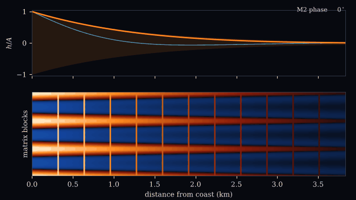

# Supplementary Materials "An Idealized Model of Matrix Storage and the Tidal Response of Coastal Aquifers"

[](https://www.python.org)
[](https://numpy.org)
[](https://scipy.org)
[](https://peps.python.org/pep-0008/)
[](LICENSE)

Supplementary code for an idealized, data-free theory of how storage
exchange between conduits and matrix blocks changes the attenuation and
phase lag of tides propagating into a coastal aquifer, and when that
memory acts as a time-fractional medium.

**Authors:** Sandy H. S. Herho, Dasapta E. Irawan, Rusmawan Suwarman, Iwan P. Anwar, and Deny J. Puradimaja

<p align="center">
  <br>
  One M2 cycle: conduit head (amber) and the head inside matrix blocks. Classical aquifer with the same storage in cyan.
</p>

| [ratio spectrum](outputs/animations/anim02_ratio.gif) | [nonlinear water table](outputs/animations/anim03_watertable.gif) |
| :---: | :---: |
| r(Ω) as matrix storage grows | classical and memory aquifers, ε = 0.2 |

## Key results

Each tidal constituent decays inland as $e^{-(a+ib)x}$ with
$\kappa^2 = i\Omega\,c(\Omega)$, $c = 1 + \beta G$, $\beta = S_{im}/S_m$.
The measured pair $(a, b)$ is exactly the complex storage capacity at that
frequency:

$$a^2 - b^2 = -\Omega\,\mathrm{Im}\,c, \qquad 2ab = \Omega\,\mathrm{Re}\,c .$$

Leakage makes $a^2 - b^2$ constant in frequency; storage memory makes it
a relaxation peak. One constituent alone can never tell them apart.

For any passive storage exchange or leakage, $r = b/a \le 1$. For
diffusive exchange with matrix blocks of any sizes,

$$r \ge \tan\!\left(\frac{\pi}{8} + \frac{\delta_{slab}}{2}\right) = 0.39798, \qquad \delta_{slab} = \min_u \arctan\frac{\sin 2u}{\sinh 2u} = -0.027868,$$

and $r > \tan(\pi/8) = 0.41421$ for cylindrical or spherical blocks.

Power-law block-size distributions $q s^{q-1}$ give, exactly up to
exponentially small terms,

$$G = q I_q (i\Omega)^{-q/2} - \frac{q}{1-q}(i\Omega)^{-1/2},$$

a time-fractional plateau of order $\gamma = 1 - q/2 \in (1/2, 1)$ with
$r = \tan(\gamma\pi/4)$. Matrix diffusion cannot give an order below one
half.

In the nonlinear unconfined aquifer the period mean of $H^2$ equals
$1 + \varepsilon^2/2$ everywhere, and the mean water-table rise
$(\varepsilon^2/4)(1 - e^{-2ax})$ carries attenuation only.

| reference aquifer (β = 20, τ = 1.50 d) | value |
| --- | --- |
| r at M2, K1 | 0.493, 0.459 |
| r at MSf, Sa | 0.820, 0.992 |
| detection power vs leakage, M2 S2 K1 O1, 30 d | λ = 5.5e3 |
| weak memory β = 0.2 (r ≈ 0.97), same record | λ = 34.5, power 0.998 |
| switch-on transient of a Caputo medium, γ = 0.75 | decays as t^-1.375 |

## Verification

| check | result |
| --- | --- |
| dual porosity vs exact, spatial orders | 1.96, 1.98, 2.00, 2.00 |
| BDF2 temporal orders | 1.98 to 2.00 |
| L1 orders, γ = 0.25, 0.5, 0.75 (theory 2 - γ) | 1.72, 1.49, 1.25 |
| Kramers-Kronig, slab / cylinder / sphere, max abs | 9.2e-12, 9.2e-12, 9.7e-12 |
| power-law quadrature vs closed form | 7e-16 to 6e-15 |
| Caputo exact solution at t = 0 | -2.8e-17 |
| nonlinear first-harmonic correction, slope (theory 2) | 2.000 |
| H² invariant, classical / memory | 5.7e-13, 6.4e-8 |

Full residuals are in `outputs/reports/verification.txt`.

## Run

```
pip install -r requirements.txt
python scripts/run_all.py
```

About five minutes on one core. Expensive runs cache to `outputs/cache/`
and are skipped on reruns.

## Layout

```
pasang/      capacity, propagation, bounds, kk, dualporosity, caputo,
             boussinesq, harmonic, information, scenario,
             plotting, anim, io_utils
scripts/     fig00-fig08, anim01-anim03, make_reports, run_all
outputs/     figures (PDF, 600 dpi PNG), animations (GIF),
             data (CSV per panel), reports (plain text)
```

## Limitations

The reference parameters are illustrative values for a karstic limestone
aquifer, not measurements, and no field record is used. The model is one
dimensional with a vertical coastline, uniform matrix geometry, and no
density, seepage-face, or tidal-loading effects; ratios above one, which
geometry can produce, are outside its scope. The identifiability study
assumes white noise and exact coastal records, so its thresholds are
optimistic. Details are in `outputs/reports/open_items.txt`.
